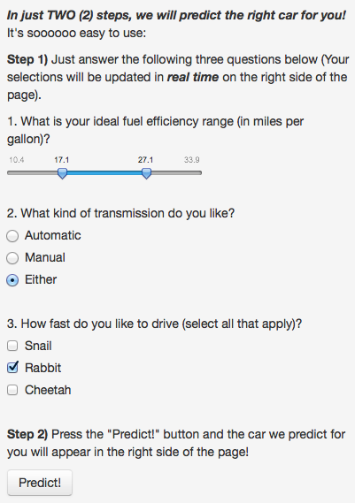
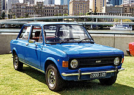

Let's choose the right car for you!
===
author: Developing Data Products: Course Project 1b R Presentation
date: A.Kao: 2014.08.11
css: Custom.css
transition: zoom

Have you ever had trouble finding the right 1974 automobile to suit your tastes and needs?
===
incremental: true

- Don't fret, we're here to help!
- Our sophisticasted prediction algorithm can match you with the right car!
- All in two easy steps!!!

What are these two "easy" steps?
===
incremental: true

1. Answer a basic questionnaire relating to options you prefer in your dream 1974 car.
    - Fuel efficiency
    - Transmission type
    - Driving style
2. Press the magic "Predict!" button and wait for our prediction.
    - Results not shown here
    - Not responsible for unsatisfied customers

***



How do we do it?
===

- Our secret formula (shhhh, don't tell anyone!) lies in the Motor Trend magazine's database of fine motorcars.
    - Extensive listing of thirty-two (32) cars from 1974
    - Over ten (10) meticulously curated details for each car
- Here's a sample of this comprehensive database:


```
                   mpg cyl disp  hp drat
Mazda RX4         21.0   6  160 110 3.90
Mazda RX4 Wag     21.0   6  160 110 3.90
Datsun 710        22.8   4  108  93 3.85
Hornet 4 Drive    21.4   6  258 110 3.08
Hornet Sportabout 18.7   8  360 175 3.15
Valiant           18.1   6  225 105 2.76
Duster 360        14.3   8  360 245 3.21
```

Your mileage (pun intended!) may vary!!!
===
incremental: true

- Reports of satisfied customers include:
    - Bob Bobson: "Awesome!"
    - Len Lenderson: "It's okay I guess."
    - Anonymous: "Why did I buy this old car???" 
    - Hodor: "HODOR!!!"
- Have fun and good luck using our prediction software, [link to our car prediction software hosted on ShinyApps.io](http://atet.shinyapps.io/CP1a_ShinyApp/)
- *We are not responsible for unsatisfied customers*.
